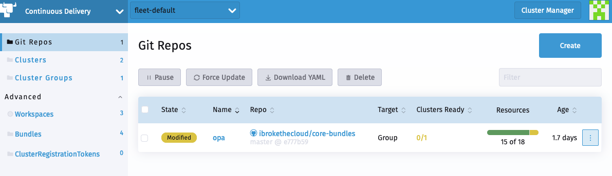
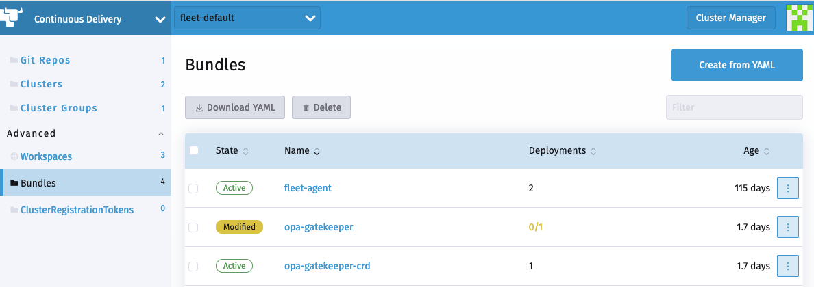
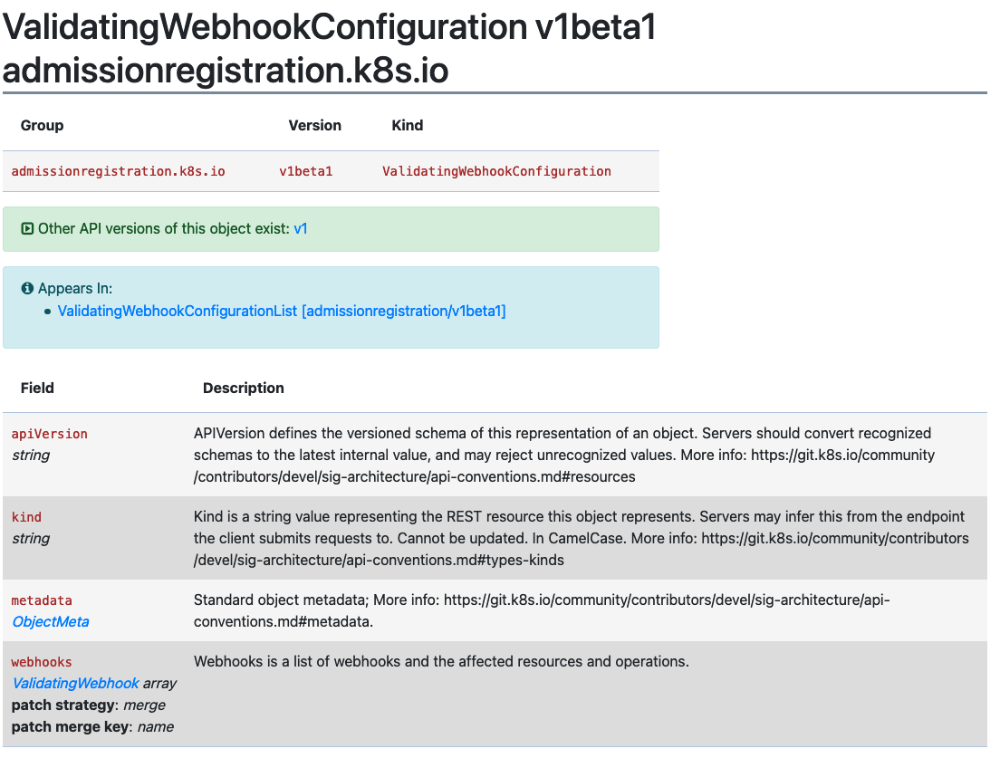

# Generating Diffs to Ignore Modified GitRepos


Continuous Delivery in Rancher is powered by Fleet. When a user adds a GitRepo CR, then Continuous Delivery creates the associated fleet bundles.

You can access these bundles by navigating to the Cluster Explorer (Dashboard UI), and selecting the `Bundles` section.

The bundled charts may have some objects that are amended at runtime, for example:
* in a ValidatingWebhookConfiguration, the `caBundle` is empty and the CA cert is injected by the cluster.
* an installed chart may create a job, which is then deleted once completed

This leads the status of the bundle and associated GitRepo to be reported as "Modified"



Associated Bundle


Fleet bundles support the ability to specify a custom [jsonPointer patch](http://jsonpatch.com/).

With the patch, users can instruct fleet to ignore:
* object modifications
* entire objects

## Generating comparePatches with `fleet bundlediff`

The `fleet bundlediff` CLI command reads the diff information already present in `Bundle` and
`BundleDeployment` status fields and displays it in a human-readable form. It also outputs a
ready-to-use `diff:` snippet in `fleet.yaml` format so you can accept the observed drift
without manually constructing the JSON Patch paths.

### Viewing diffs

```bash
# Show all diffs across all namespaces, grouped by Bundle
fleet bundlediff

# Show diffs for a specific Bundle
fleet bundlediff --bundle my-bundle

# Show diffs for a specific BundleDeployment
fleet bundlediff --bundle-deployment my-bundle-deployment -n cluster-fleet-local-local-abc123

# Output in JSON format
fleet bundlediff --json
```

Default text output groups results by `Bundle` and lists each modified or non-ready resource
together with its JSON Merge Patch:

```
Bundle: my-bundle
BundleDeployments with diffs: 1
━━━━━━━━━━━━━━━━━━━━━━━━━━━━━━━━━━━━━━━━━━━━━━━━━━━━━━━━━━━━━━━━━━

  BundleDeployment: cluster-fleet-local-local-abc123/my-bundle-deployment
  Modified Resources (1):
    Resource: ConfigMap.v1 default/my-config
    Status: Modified
    Patch:
    {
      "metadata": {
        "annotations": {
          "timestamp": "2024-01-15T10:30:00Z"
        }
      }
    }
```

### Generating a `fleet.yaml` `comparePatches` snippet

Use `--fleet-yaml` together with `--bundle-deployment` to produce a `diff:` block that
can be pasted directly into your `fleet.yaml`. The command converts the observed JSON
Merge Patch into `remove` operations and merges them with any `comparePatches` already
configured on the `Bundle`, so existing ignores are preserved.

```bash
fleet bundlediff \
  --fleet-yaml \
  --bundle-deployment my-bundle-deployment \
  -n cluster-fleet-local-local-abc123
```

Example output:

```yaml
diff:
  comparePatches:
  - apiVersion: v1
    kind: ConfigMap
    name: my-config
    namespace: default
    operations:
    - op: remove
      path: /metadata/annotations/timestamp
```

You can redirect this output and add it to your `fleet.yaml` in Git:

```bash
fleet bundlediff \
  --fleet-yaml \
  --bundle-deployment my-bundle-deployment \
  -n cluster-fleet-local-local-abc123 >> fleet.yaml
```

Once you commit and push the updated `fleet.yaml`, Fleet reconciles the change and the
bundle transitions from "Modified" to "Ready". The field itself is not reverted — Fleet
simply stops reporting it as drift.

:::note
`--fleet-yaml` requires `--bundle-deployment` to be specified, because the output is
merged with the existing `comparePatches` from the associated `Bundle`.
:::

See [fleet bundlediff](./cli/fleet-cli/fleet_bundlediff) for the full flag reference.

## Ignoring object modifications

### Simple Example

In this simple example, we create a Service and ConfigMap that we apply a bundle diff onto.

https://github.com/rancher/fleet-test-data/tree/master/bundle-diffs


### Gatekeeper Example

In this example, we are trying to deploy opa-gatekeeper using Continuous Delivery to our clusters.

The opa-gatekeeper bundle associated with the opa GitRepo is in modified state.

Each path in the GitRepo CR, has an associated Bundle CR. The user can view the Bundles, and the associated diff needed in the Bundle status.

In our case the differences detected are as follows:

```yaml
  summary:
    desiredReady: 1
    modified: 1
    nonReadyResources:
    - bundleState: Modified
      modifiedStatus:
      - apiVersion: admissionregistration.k8s.io/v1
        kind: ValidatingWebhookConfiguration
        name: gatekeeper-validating-webhook-configuration
        patch: '{"$setElementOrder/webhooks":[{"name":"validation.gatekeeper.sh"},{"name":"check-ignore-label.gatekeeper.sh"}],"webhooks":[{"clientConfig":{"caBundle":"Cg=="},"name":"validation.gatekeeper.sh","rules":[{"apiGroups":["*"],"apiVersions":["*"],"operations":["CREATE","UPDATE"],"resources":["*"]}]},{"clientConfig":{"caBundle":"Cg=="},"name":"check-ignore-label.gatekeeper.sh","rules":[{"apiGroups":[""],"apiVersions":["*"],"operations":["CREATE","UPDATE"],"resources":["namespaces"]}]}]}'
      - apiVersion: apps/v1
        kind: Deployment
        name: gatekeeper-audit
        namespace: cattle-gatekeeper-system
        patch: '{"spec":{"template":{"spec":{"$setElementOrder/containers":[{"name":"manager"}],"containers":[{"name":"manager","resources":{"limits":{"cpu":"1000m"}}}],"tolerations":[]}}}}'
      - apiVersion: apps/v1
        kind: Deployment
        name: gatekeeper-controller-manager
        namespace: cattle-gatekeeper-system
        patch: '{"spec":{"template":{"spec":{"$setElementOrder/containers":[{"name":"manager"}],"containers":[{"name":"manager","resources":{"limits":{"cpu":"1000m"}}}],"tolerations":[]}}}}'
```

Based on this summary, there are three objects which need to be patched.

We will look at these one at a time.

#### 1. ValidatingWebhookConfiguration:
The gatekeeper-validating-webhook-configuration validating webhook has two ValidatingWebhooks in its spec.

In cases where more than one element in the field requires a patch, that patch will refer these to as `$setElementOrder/ELEMENTNAME`

From this information, we can see the two ValidatingWebhooks in question are:

```
  "$setElementOrder/webhooks": [
    {
      "name": "validation.gatekeeper.sh"
    },
    {
      "name": "check-ignore-label.gatekeeper.sh"
    }
  ],
```

Within each ValidatingWebhook, the fields that need to be ignore are as follows:

```
    {
      "clientConfig": {
        "caBundle": "Cg=="
      },
      "name": "validation.gatekeeper.sh",
      "rules": [
        {
          "apiGroups": [
            "*"
          ],
          "apiVersions": [
            "*"
          ],
          "operations": [
            "CREATE",
            "UPDATE"
          ],
          "resources": [
            "*"
          ]
        }
      ]
    },
 ```

 and

 ```
     {
      "clientConfig": {
        "caBundle": "Cg=="
      },
      "name": "check-ignore-label.gatekeeper.sh",
      "rules": [
        {
          "apiGroups": [
            ""
          ],
          "apiVersions": [
            "*"
          ],
          "operations": [
            "CREATE",
            "UPDATE"
          ],
          "resources": [
            "namespaces"
          ]
        }
      ]
    }
```

In summary, we need to ignore the fields `rules` and `clientConfig.caBundle` in our patch specification.

The field webhook in the ValidatingWebhookConfiguration spec is an array, so we need to address the elements by their index values.



Based on this information, our diff patch would look as follows:

```yaml
  - apiVersion: admissionregistration.k8s.io/v1
    kind: ValidatingWebhookConfiguration
    name: gatekeeper-validating-webhook-configuration
    operations:
    - {"op": "remove", "path":"/webhooks/0/clientConfig/caBundle"}
    - {"op": "remove", "path":"/webhooks/0/rules"}
    - {"op": "remove", "path":"/webhooks/1/clientConfig/caBundle"}
    - {"op": "remove", "path":"/webhooks/1/rules"}
```

#### 2. Deployment gatekeeper-controller-manager:
The gatekeeper-controller-manager deployment is modified since there are cpu limits and tolerations applied (which are not in the actual bundle).

```
{
  "spec": {
    "template": {
      "spec": {
        "$setElementOrder/containers": [
          {
            "name": "manager"
          }
        ],
        "containers": [
          {
            "name": "manager",
            "resources": {
              "limits": {
                "cpu": "1000m"
              }
            }
          }
        ],
        "tolerations": []
      }
    }
  }
}
```

In this case, there is only 1 container in the deployment container spec, and that container has cpu limits and tolerations added.

Based on this information, our diff patch would look as follows:
```yaml
  - apiVersion: apps/v1
    kind: Deployment
    name: gatekeeper-controller-manager
    namespace: cattle-gatekeeper-system
    operations:
    - {"op": "remove", "path": "/spec/template/spec/containers/0/resources/limits/cpu"}
    - {"op": "remove", "path": "/spec/template/spec/tolerations"}
```

#### 3. Deployment gatekeeper-audit:
The gatekeeper-audit deployment is modified in a similarly, to the gatekeeper-controller-manager, with additional cpu limits and tolerations applied.

```
{
  "spec": {
    "template": {
      "spec": {
        "$setElementOrder/containers": [
          {
            "name": "manager"
          }
        ],
        "containers": [
          {
            "name": "manager",
            "resources": {
              "limits": {
                "cpu": "1000m"
              }
            }
          }
        ],
        "tolerations": []
      }
    }
  }
}
```

Similar to gatekeeper-controller-manager, there is only 1 container in the deployments container spec, and that has cpu limits and tolerations added.

Based on this information, our diff patch would look as follows:
```yaml
  - apiVersion: apps/v1
    kind: Deployment
    name: gatekeeper-audit
    namespace: cattle-gatekeeper-system
    operations:
    - {"op": "remove", "path": "/spec/template/spec/containers/0/resources/limits/cpu"}
    - {"op": "remove", "path": "/spec/template/spec/tolerations"}
```

#### Combining It All Together
We can now combine all these patches as follows:

```yaml
diff:
  comparePatches:
  - apiVersion: apps/v1
    kind: Deployment
    name: gatekeeper-audit
    namespace: cattle-gatekeeper-system
    operations:
    - {"op": "remove", "path": "/spec/template/spec/containers/0/resources/limits/cpu"}
    - {"op": "remove", "path": "/spec/template/spec/tolerations"}
  - apiVersion: apps/v1
    kind: Deployment
    name: gatekeeper-controller-manager
    namespace: cattle-gatekeeper-system
    operations:
    - {"op": "remove", "path": "/spec/template/spec/containers/0/resources/limits/cpu"}
    - {"op": "remove", "path": "/spec/template/spec/tolerations"}
  - apiVersion: admissionregistration.k8s.io/v1
    kind: ValidatingWebhookConfiguration
    name: gatekeeper-validating-webhook-configuration
    operations:
    - {"op": "remove", "path":"/webhooks/0/clientConfig/caBundle"}
    - {"op": "remove", "path":"/webhooks/0/rules"}
    - {"op": "remove", "path":"/webhooks/1/clientConfig/caBundle"}
    - {"op": "remove", "path":"/webhooks/1/rules"}
```

We can add these now to the bundle directly to test and also commit the same to the `fleet.yaml` in your GitRepo.

Once these are added, the GitRepo should deploy and be in "Active" status.


## Ignoring entire objects

When installing a chart such as [Consul](https://developer.hashicorp.com/consul/docs/k8s/helm), a job named
`consul-server-acl-init` is created, then deleted once it has successfully completed.

That chart can be installed by creating a `GitRepo` pointing to a git repository using a `fleet.yaml` such as:
```yaml
defaultNamespace: consul
helm:
  releaseName: test-consul
  chart: "consul"
  repo: "https://helm.releases.hashicorp.com"

  values:
    global:
      name: consul
      acls:
        manageSystemACLs: true
```

Installing this chart will result in the `GitRepo` reporting a `Modified` status, with job `consul-server-acl-init`
missing, once that job has completed.

This can be remedied with the following bundle diff in our `fleet.yaml`:
```yaml
diff:
  comparePatches:
  - apiVersion: batch/v1
    kind: Job
    namespace: consul
    name: consul-server-acl-init
    operations:
    - {"op":"ignore"}
```
