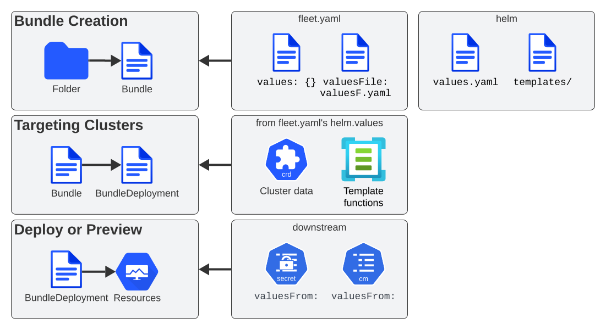

# Git Repository Contents

Fleet will create bundles from a git repository. This happens either explicitly by specifying paths, or when a `fleet.yaml` is found.
The folder could contain a Helm chart, or reference one. It could be a plain Kubernetes manifest, or a Kustomize folder. Each bundle is converted to a single Helm chart for deployment.

The `fleet.yaml` file contains all the options for the deployment.

## Bundle Names

By default, bundle names will also be generated from the GitRepo's name and the path from which the bundle is created.
However, a bundle's name can be overridden by using the `name` field in a `fleet.yaml` file.

Bundle lifecycles are tracked between releases by the Helm `releaseName` field added to each bundle. If the releaseName is not
specified within fleet.yaml it is generated from `GitRepo.name + path`. Long names are truncated and a `-<hash>` prefix is added.

## How repos are scanned

**The git repository has no explicitly required structure.** It is important
to realize the scanned resources will be saved as a resource in Kubernetes so
you want to make sure the directories you are scanning in git do not contain
arbitrarily large resources. Right now there is a limitation that the resources
deployed must **gzip to less than 1MB**.


Multiple paths can be defined for a `GitRepo` and each path is scanned independently.
Internally each scanned path will become a [bundle](./concepts.md) that Fleet will manage,
deploy, and monitor independently.

Fleet looks for the following files to determine how the resources will be deployed.

| File | Location | Meaning |
|------|----------|---------|
| **Chart.yaml**:| / relative to `path` or custom path from `fleet.yaml` | The resources will be deployed as a Helm chart. Refer to the `fleet.yaml` for more options. |
| **kustomization.yaml**:| / relative to `path` or custom path from `fleet.yaml` | The resources will be deployed using Kustomize. Refer to the `fleet.yaml` for more options. |
| **fleet.yaml** | Any subpath | If any fleet.yaml is found a new [bundle](./concepts.md) will be defined. This allows mixing charts, kustomize, and raw YAML in the same repo |
| ** *.yaml ** | Any subpath | If a `Chart.yaml` or `kustomization.yaml` is not found then any `.yaml` or `.yml` file will be assumed to be a Kubernetes resource and will be deployed. |
| **overlays/`{name}`** | / relative to `path` | When deploying using raw YAML (not Kustomize or Helm) `overlays` is a special directory for customizations. |

### Alternative scan, explicitly defined by the user

In addition to the previously described method, Fleet also supports a more direct, user-driven approach for defining Bundles.

In this mode, Fleet will load all resources found within the specified base directory. It will only attempt to locate a `fleet.yaml` file at the root of that directory if an options file is not explicitly provided.
Unlike the traditional scanning method, this one is not recursive and does not attempt to find Bundle definitions other than those explicitly specified by the user.

#### Example Directory Structure
```
driven
     |___helm
     |      |__ fleet.yaml
     |
     |___simple
     |      |__ configmap.yaml
     |      |__ service.yaml
     |
     |___kustomize
            |__ base
            |      |__ kustomization.yaml
            |      |__ secret.yaml
            |
            |__ overlays
            |         |__ dev
            |         |     |__ kustomization.yaml
            |         |     |__ secret.yaml
            |         |__ prod
            |         |     |__ kustomization.yaml
            |         |     |__ secret.yaml
            |         |__ test
            |               |__ kustomization.yaml
            |               |__ secret.yaml
            |__ dev.yaml
            |__ prod.yaml
            |__ test.yaml
```
#### Corresponding GitRepo Definition
```
kind: GitRepo
apiVersion: fleet.cattle.io/v1alpha1
metadata:
  name: driven
  namespace: fleet-local
spec:
  repo: https://github.com/0xavi0/fleet-test-data
  branch: driven-scan-example
  bundles:
  - base: driven/helm
  - base: driven/simple
  - base: driven/kustomize
    options: dev.yaml
  - base: driven/kustomize
    options: test.yaml
```

In the example above, the user explicitly defines four Bundles to be generated.

* In the first case, the base directory is specified as `driven/helm`. As shown in the directory structure, this path contains a `fleet.yaml` file, which will be used to configure the Bundle.

* In the second case, the base directory is `driven/simple`, which contains only Kubernetes resource manifests (`configmap.yaml` and `service.yaml`). Since no `fleet.yaml` or options file is specified, Fleet will generate a Bundle using the default behavior—simply packaging all resources found within the directory.

* The third and fourth cases both reference the same base directory: `driven/kustomize`. However, each specifies a different options file (`dev.yaml` and `test.yaml`, respectively). These options files define overlay-specific configuration for each environment (e.g., dev, test) by selecting the appropriate kustomize overlay subdirectories and applying them on top of the shared base.
Fleet will process these as distinct Bundles, even though they originate from the same base path, because the provided options files point to different configurations.


An example of the files used in the third and fourth Bundles would be the following: (These files follow the exact same format as `fleet.yaml`, but since we can now reference them by name, we can use one that best suits our needs)
```yaml
namespace: kustomize-dev
kustomize:
  dir: "overlays/dev"
```
It is important to note that any path defined in these files must be relative to the base directory used when the Bundle was described.

For example, with the previously mentioned structure, we are defining the base directory as `driven/kustomize`. That is the directory we need to use as the root for the paths used in Kustomize files.

We could decide to place the `dev.yaml` file at the path `driven/kustomize/overlays/dev` (this is supported), and then define the Bundle as:
```yaml
bundles:
    - base: driven/kustomize
      options: overlays/dev/dev.yaml
```
However, the path defined within `dev.yaml` should still be relative to `driven/kustomize`.
This is because when Fleet reads the options files, it always uses the base directory as the root.

In other words, with the previous example... this would be incorrect:
```yaml
namespace: kustomize-dev
kustomize:
  dir: "."
```
And the correct definition should still be:
```yaml
namespace: kustomize-dev
kustomize:
  dir: "overlays/dev"
```

With this new way of defining Bundles, Fleet becomes much more direct and also simplifies the adoption of deployments using kustomize.
In the example, we can see a complete kustomize use case where for each Bundle, we can specify which version we want.

With the previous scanning option, Fleet cannot determine which YAML we want to use to configure the Bundle, so it attempts to find it on its own (Which, at times, does not provide enough flexibility.)

:::warning excluding irrelevant files from user-scanned bundles
When using this bundle scanning mode, Fleet does not exclude bundle configuration files which are not explicitly
referenced in the GitRepo. For instance, in the above example file structure:
* by default, neither `prod.yaml` nor `test.yaml` would be excluded from the bundle using `dev.yaml` as its options file
* similarly, by default, neither `dev.yaml` nor `prod.yaml` would be excluded from the bundle using `test.yaml` as its options file

This can be mitigated by using a `.fleetignore` file next to `{dev,test,prod}.yaml` excluding all three of them.
See the next section for more details on `.fleetignore` files.
:::

### Excluding files and directories from bundles

Fleet supports file and directory exclusion by means of `.fleetignore` files, in a similar fashion to how `.gitignore`
files behave in git repositories:
* Glob syntax is used to match files or directories, using Golang's
  [`filepath.Match`](https://pkg.go.dev/path/filepath#Match)
* Empty lines are skipped, and can therefore be used to improve readability
* Characters like white spaces and `#` can be escaped with a backslash
* Trailing spaces are ignored, unless escaped
* Comments, ie lines starting with unescaped `#`, are skipped
* A given line can match a file or a directory, even if no separator is provided: eg. `subdir/*` and `subdir` are both
  valid `.fleetignore` lines, and `subdir` matches both files and directories called `subdir`
* A match may be found for a file or directory at any level below the directory where a `.fleetignore` lives, ie
  `foo.yaml` will match `./foo.yaml` as well as `./path/to/foo.yaml`
* Multiple `.fleetignore` files are supported. For instance, in the following directory structure, only
  `root/something.yaml`, `bar/something2.yaml` and `foo/something.yaml` will end up in a bundle:
```
root/
├── .fleetignore            # contains `ignore-always.yaml'
├── something.yaml
├── bar
│   ├── .fleetignore        # contains `something.yaml`
│   ├── ignore-always.yaml
│   ├── something2.yaml
│   └── something.yaml
└── foo
    ├── ignore-always.yaml
    └── something.yaml
```

This currently comes with a few limitations, the following not being supported:
* Double asterisks (`**`)
* Explicit inclusions with `!`

## `fleet.yaml`

The `fleet.yaml` is an optional file that can be included in the git repository to change the behavior of how
the resources are deployed and customized.  The `fleet.yaml` is always at the root relative to the `path` of the `GitRepo`
and if a subdirectory is found with a `fleet.yaml` a new [bundle](./concepts.md) is defined that will then be
configured differently from the parent bundle.

:::caution

__Helm chart dependencies__:
Fleet automatically handles updating Helm chart dependencies, unless flag `disableDependencyUpdate` (`false` by
default) is set to `true`.

If automatic dependencies updates are disabled, it is up to the user to fulfill the dependency list for the Helm charts.
As such, you must manually run `helm dependencies update $chart` OR run `helm dependencies build $chart` prior to
install. See the [Fleet
docs](https://ranchermanager.docs.rancher.com/integrations-in-rancher/fleet/overview#helm-chart-dependencies) in Rancher for
more information.

:::

The available fields are documented in the [fleet.yaml reference](./ref-fleet-yaml.md)

For a private Helm repo, users can reference a secret from the git repo resource.
See [Using Private Helm Repositories](./gitrepo-add.md#using-private-helm-repositories) for more information.

## Using Helm Values

__How changes are applied to `values.yaml`__:

- The most recently applied changes to the `values.yaml` override any previously existing values.

- When changes are applied to the `values.yaml` from multiple sources at the same time, the values update in the following order: 
  1. `helm.values`
  2. `helm.valuesFiles`
  3. `helm.valuesFrom`

This means that `valuesFrom` always overrides both `valuesFiles` and `values`.  



### Templating

The targeting step can treat the values as a template and fill in information from the `clusters.fleet.cattle.io` resource. For more information, refer to [Helm values templating](./ref-fleet-yaml#values-templating).

You can turn this off in `fleet.yaml`, by setting `disablePreProcess`. This is useful to avoid conflicts with other templating languages.

It is not necessary to reference a chart's own `values.yaml` via `valuesFiles:`. The `values.yaml` file contained in the
chart is always used as a default when the agent installs the chart.

:::note Credentials in Values

If the chart generates certificates or passwords in its templates, these values must be overridden. Otherwise the chart could be continuously deployed as these values change.

Credentials loaded from the downstream cluster with `valuesFrom` are by default encrypted at rest, when [data encryption](https://kubernetes.io/docs/tasks/administer-cluster/encrypt-data/) is enabled in Kubernetes. Credentials contained in the default `values.yaml` file, or defined via `values:` or `valuesFiles` are not, as they are loaded from the repository when the bundle is created.

Hardened clusters should add the Fleet CRDs to the [list of resources encrypted at rest](gitrepo-add#storing-credentials-in-git), on the upstream cluster, when storing credentials in the bundles.

:::

### Understanding Helm `values.yaml` vs Fleet `valuesFiles`

Installing Helm charts with Fleet offers multiple ways of configuring and referencing values, using the chart’s built-in `values.yaml` and additional values files referenced in `fleet.yaml`. These files serve different purposes, and it’s important to understand how they interact.


**Example directory structure:**

```bash
.
├── Chart.yaml
├── fleet.yaml
├── README.md
├── templates/
│   ├── deployment.yaml
│   └── service.yaml
└── values.yaml   # chart defaults
```

You can use a Helm chart’s `values.yaml` file to:

* Provide default settings and allow users to override defaults without modifying the chart itself.  
* Define common Kubernetes resource defaults.

:::note
A Helm chart's `values.yaml` does not support templating. Any substitutions happen during chart rendering before Fleet applies the chart.

* You cannot use shell-style variables (for example, `${var}`) inside this file.  
* If `${var}` appears, Helm treats it as plain text—you don’t need to escape it.
:::

### **Fleet valuesFiles referenced from fleet.yaml**

Fleet lets you reference additional values files through `fleet.yaml`. These files override or extend the chart’s baseline defaults.

* A `valuesFiles` entry is equivalent to copy-pasting the contents of that file into the values section of `fleet.yaml`.  
* It’s mainly a convenience feature for splitting values into multiple files.  
* Unlike Helm chart `values.yaml`, Fleet’s values files support templating, which enables dynamic configuration per environment.

**Example fleet.yaml:**
```yaml
helm:  
  valuesFiles:  
    - values.prod.yaml   # overrides baseline
```

You can use fleet `valuesFiles` referenced from `fleet.yaml` to:

* Apply environment-specific overrides (dev, staging, prod).  
* Enable advanced features not included in chart defaults.

:::note **Best practice**

Whether you use helm `values.yaml`, `fleet.yaml` values:, or `valuesFiles`, never store credentials in these files.

The recommended and safer approach is to use `valuesFrom`, which references Kubernetes Secrets or ConfigMaps. Although this requires creating the Secrets on downstream clusters, it ensures sensitive data is stored securely.
:::

### Using ValuesFrom

These examples showcase the style and format for using `valuesFrom`.

:::note **Propagating ConfigMaps and Secrets to downstream clusters**
ConfigMaps and Secrets should generally be created directly in *downstream clusters*.

However, from Fleet v0.14.0 onwards, they can also be referenced through a HelmOp's `downstreamResources` field to be
automatically propagated to targeted downstream clusters.

See [this page](experimental-downstream-resources.md) for more details.
:::

Example [ConfigMap](https://kubernetes.io/docs/concepts/configuration/configmap/):

```yaml
apiVersion: v1
kind: ConfigMap
metadata:
  name: configmap-values
  namespace: default
data:
  values.yaml: |-
    replication: true
    replicas: 2
    serviceType: NodePort
```

Example [Secret](https://kubernetes.io/docs/concepts/configuration/secret/):

```yaml
apiVersion: v1
kind: Secret
metadata:
  name: secret-values
  namespace: default
stringData:
  values.yaml: |-
    replication: true
    replicas: 3
    serviceType: NodePort
```

A secret like that, can be created from a YAML file `secretdata.yaml` by running the following kubectl command: `kubectl create secret generic secret-values --from-file=values.yaml=secretdata.yaml`

The resources can then be referenced from a `fleet.yaml`:

```yaml
helm:
  chart: simple-chart
  valuesFrom:
    - secretKeyRef:
        name: secret-values
        namespace: default
        key: values.yaml
    - configMapKeyRef:
        name: configmap-values
        namespace: default
        key: values.yaml
  values:
    replicas: "4"
```

## Per Cluster Customization

The `GitRepo` defines which clusters a git repository should be deployed to and the `fleet.yaml` in the repository
determines how the resources are customized per target.

All clusters and cluster groups in the same namespace as the `GitRepo` will be evaluated against all targets of that
`GitRepo`. The targets list is evaluated one by one and if there is a match the resource will be deployed to the cluster.
If no match is made against the target list on the `GitRepo` then the resources will not be deployed to that cluster.
Once a target cluster is matched the `fleet.yaml` from the git repository is then consulted for customizations. The
`targetCustomizations` in the `fleet.yaml` will be evaluated one by one and the first match will define how the
resource is to be configured. If no match is made the resources will be deployed with no additional customizations.

There are three approaches to matching clusters for both `GitRepo` `targets` and `fleet.yaml` `targetCustomizations`.
One can use cluster selectors, cluster group selectors, or an explicit cluster group name.  All criteria is additive so
the final match is evaluated as "clusterSelector && clusterGroupSelector && clusterGroup".  If any of the three have the
default value it is dropped from the criteria.  The default value is either null or "".  It is important to realize
that the value `{}` for a selector means "match everything."

```yaml
targetCustomizations:
- name: all
  # Match everything
  clusterSelector: {}
- name: none
  # Selector ignored
  clusterSelector: null
```

When matching a cluster by name, make sure to use the name of the
`clusters.fleet.cattle.io` resource. The Rancher UI also has a provisioning and
a management cluster resource. Since the management cluster resource is not
namespaced, its name is different and contains a random suffix.

```yaml
targetCustomizations:
- name: prod
  clusterName: fleetname
```

See [Mapping to Downstream Clusters](gitrepo-targets#customization-per-cluster) for more information and a list of supported customizations.

## Raw YAML Resource Customization

When using Kustomize or Helm the `kustomization.yaml` or the `helm.values` will control how the resource are
customized per target cluster. If you are using raw YAML then the following simple mechanism is built-in and can
be used.  The `overlays/` folder in the git repo is treated specially as folder containing folders that
can be selected to overlay on top per target cluster. The resource overlay content
uses a file name based approach.  This is different from kustomize which uses a resource based approach.  In kustomize
the resource Group, Kind, Version, Name, and Namespace identify resources and are then merged or patched.  For Fleet
the overlay resources will override or patch content with a matching file name.

```shell
# Base files
deployment.yaml
svc.yaml

# Overlay files

# The following file will be added
overlays/custom/configmap.yaml
# The following file will replace svc.yaml
overlays/custom/svc.yaml
# The following file will patch deployment.yaml
overlays/custom/deployment_patch.yaml
```

A file named `foo` will replace a file called `foo` from the base resources or a previous overlay.  In order to patch
the contents of a file the convention of adding `_patch.` (notice the trailing period) to the filename is used. The string `_patch.`
will be replaced with `.` from the file name and that will be used as the target.  For example `deployment_patch.yaml`
will target `deployment.yaml`.  The patch will be applied using JSON Merge, Strategic Merge Patch, or JSON Patch.
Which strategy is used is based on the file content. Even though JSON strategies are used, the files can be written
using YAML syntax.

## Cluster and Bundle State

See [Cluster and Bundle state](./ref-status-fields.md).

## Nested GitRepo CRs

Nested `GitRepo CRs` (defining a `GitRepo` that points to a repository containing one or more `GitRepo` resources) is supported.
You can use this feature to take advantage of `GitOps` in your `GitRepo` resources or, for example, to split complex scenarios into more than one `GitRepo` resource.
When finding a `GitRepo` in a `Bundle` Fleet will simply deploy it as any other resource.

See [this example](https://github.com/rancher/fleet-examples/tree/master/single-cluster/multi-gitrepo).
