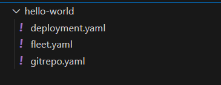
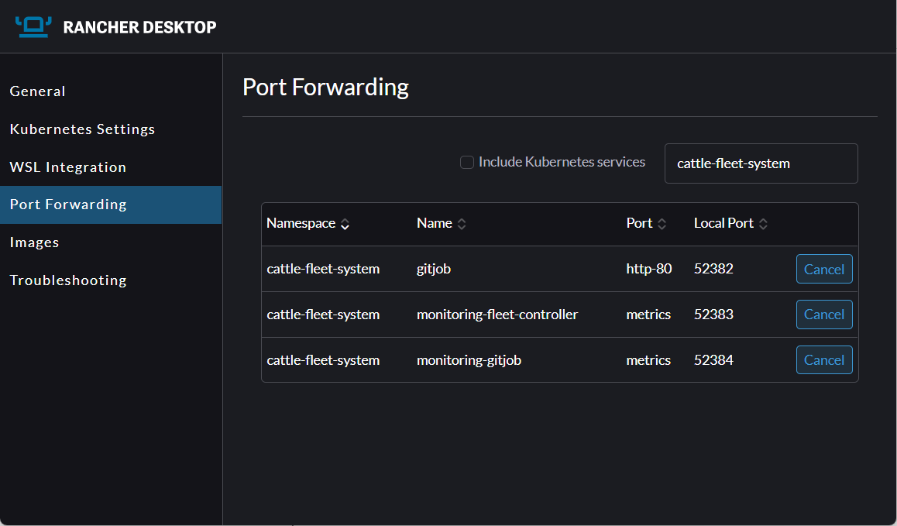

import {versions} from '@site/src/fleetVersions';
import CodeBlock from '@theme/CodeBlock';
import Tabs from '@theme/Tabs';
import TabItem from '@theme/TabItem';

# Quick Start


## Install

Fleet is distributed as a Helm chart. Helm 3 is a CLI, has no server side component, and its use is
fairly straightforward. To install the Helm 3 CLI follow the <a href="https://helm.sh/docs/intro/install">official install instructions</a>.

Fleet enables continuous delivery of Kubernetes workloads across multiple clusters using a GitOps model. In this guide, you would be deploying a basic NGINX Pod using fleet.yaml.

:::caution 
Rancher has separate helm charts for Fleet and uses a different repository.
:::

<Tabs>
  <TabItem value="linux" label="Linux/Mac" default>
    <CodeBlock language="bash">
    {`brew install helm\n`}
    {`helm repo add fleet https://rancher.github.io/fleet-helm-charts/`}
    </CodeBlock>
  </TabItem>
  <TabItem value="windows" label="Windows" default>
    <CodeBlock language="bash">
    {`choco install kubernetes-helm\n`}
    {`helm repo add fleet https://rancher.github.io/fleet-helm-charts/`}
    </CodeBlock>
  </TabItem>
</Tabs>

Install the Fleet Helm charts (there's two because we separate out CRDs for ultimate flexibility.)

<CodeBlock language="bash">
{`helm -n cattle-fleet-system install --create-namespace --wait fleet-crd \\
    fleet/fleet-crd\n`}
{`helm -n cattle-fleet-system install --create-namespace --wait fleet \\
    fleet/fleet`}
</CodeBlock>

To verify installation, run:

`kubectl get pods -n cattle-fleet-system`

## Add a Git Repo to Watch

Specify the Git repositories containing your deployment manifests or Helm charts. For hello world, example you need:
* deployment.yaml for defining workload
* fleet.yaml for how should fleet control  the deployment
* Gitrepo.yaml for where to find your git repo, which branch and sub-path to monitor.
  * (optionally) You can also add credentials

Structure your repository like this:



**deployment.yaml**

```yaml
apiVersion: apps/v1
kind: Deployment
metadata:
  name: nginx
spec:
  replicas: 1
  selector:
    matchLabels:
      app: nginx
  template:
    metadata:
      labels:
        app: nginx
    spec:
      containers:
        - name: nginx
          image: nginx:latest
```

**fleet.yaml**
```yaml
defaultNamespace: hello-world
targets:
  - name: all-dev-clusters
    clusterSelector:
      matchLabels:
        env: dev
```
Your fleet.yaml can use:
* clusterSelector: target clusters by labels (e.g., env=dev)
* targetCustomizations: override values or files per cluster.

This gives fine-grained control over how workloads are rolled out. For more information, refer to [fleet-yaml](ref-fleet-yaml.md).

**gitrepo.yaml**

```yaml
apiVersion: fleet.cattle.io/v1alpha1
kind: GitRepo
metadata:
  name: hello-world-repo
  namespace: cattle-fleet-system
spec:
  repo: https://github.com/<your-org>/my-fleet-repo
  branch: main
  paths:
    - ./hello-world
  # clientSecretName: my-ssh-key-secret ( optional: for private repos)
```

You can define a GitRepo in YAML, then apply it using kubectl.

`kubectl apply -f gitrepo.yaml`

Fleet now watches that path for changes and automatically applies the manifests.

To verify, you can either go to Rancher Desktop. Select **Continuous Delivery > Port Forwarding** to view deployment bundles.



Or you can run the following command:

```bash
kubectl get gitrepos -n fleet-default
kubectl get bundles -A
```
## Automating Deployments and Scaling

As your Kubernetes environments grow, you can scale deployments across multiple clusters without increasing pipeline complexity. Use Fleet to automate deployments, apply region-specific configurations, and monitor deployments across environments.

### Scale with Labels and Targeting

To target specific clusters, apply labels such as `env=qa` or `region=eu` to your clusters. Use the `clusterSelector` and `targetCustomizations` fields in your `fleet.yaml` file to define which clusters receive which configurations.


Fleet follows a GitOps mode, allowing you to track who made changes and when using your Git history. When you push changes to your Git repository:

1. Fleet detects the change and evaluates `fleet.yaml` to determine which clusters to target.  
1. It deploys the updated resources automatically.

For example, consider you are deploying hello world to QA environments in Europe and the US. Your clusters are labeled as follows:

| Cluster Name | Labels |
| ----- | ----- |
| `qa-eu-cluster` | `env=qa`, `region=eu` |
| `qa-us-cluster` | `env=qa`, `region=us` |

You define deployment logic in `fleet.yaml`:
```yaml
targets:
  - name: qa-eu
    clusterSelector:
      matchLabels:
        env: qa
        region: eu
    helm:
      values:
        image:
          tag: 1.0.0-eu

  - name: qa-us
    clusterSelector:
      matchLabels:
        env: qa
        region: us
    helm:
      values:
        image:
          tag: 1.0.0-us

```

When you push to Git, Fleet:

* Deploys version `1.0.0-eu` to `qa-eu-cluster`  
* Deploys version `1.0.0-us` to `qa-us-cluster`

## Next steps

Do you need to...
* Monitor private git or Helm repositories? Check [this](./gitrepo-add.md).
* Customise your deployments per target cluster? [This page](./gitrepo-targets.md) will help.
