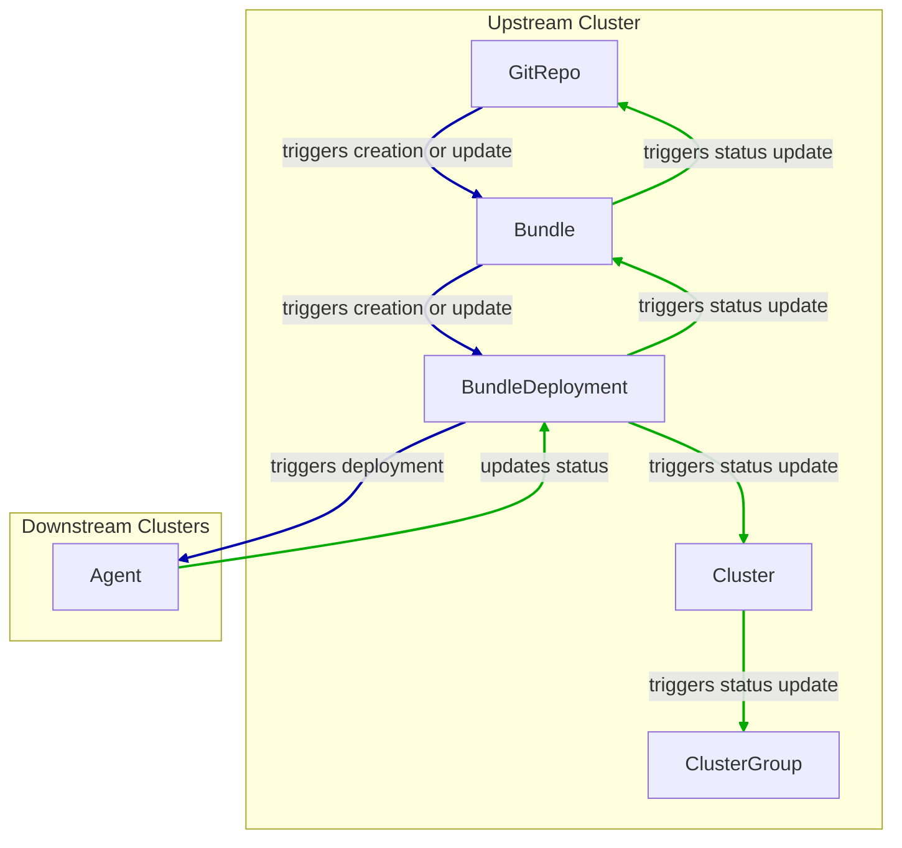
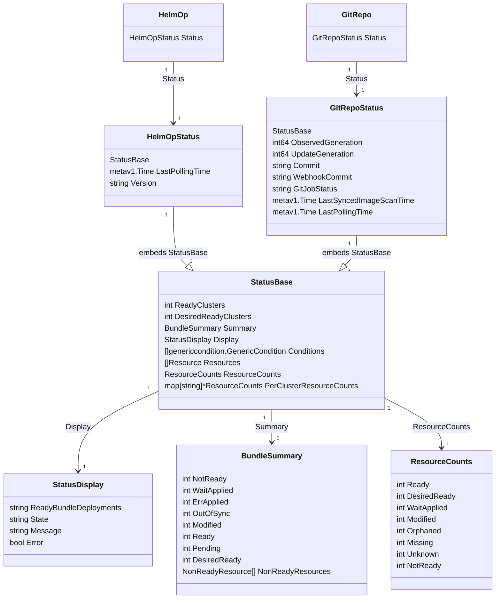

# Status Fields

<!-- markdownlint-disable MD024 -->

## Display States

GitRepos, HelmOps, Clusters and Bundles have different states in each phase of
applying Bundles.

Since the states from the BundleDeployments are propagated to the Bundle,
GitRepo, Cluster and ClusterGroup, you will find them to be displayed there in
the same way. The difference is the perspective on the resources.

By looking at the GitRepo, the states of all resources related to the GitRepo
are displayed there. When looking at the Cluster, the states of all Bundles in
that Cluster are displayed, which may span over many GitRepos. When looking at
the Bundle, the states of all BundleDeployments in that Bundle are displayed.

### Ready Condition

The `Ready` condition is used to determine if the BundleDeployments are in a
`Ready` state. The `Ready` condition is set to `True` if all BundleDeployments
are in the `Ready` state. If at least one BundleDeployment is not in the `Ready`
state, the `Ready` condition is set to `False`.

All the states of the BundleDeployments are aggregated into the `message` field
of the `Ready` status condition, but to prevent the message from becoming too
long, only the first 10 states are shown. The `message` field contains the
number of BundleDeployments in each state, followed by the Cluster name where
the BundleDeployment is located. `Ready` statuses are excluded from the
`message` field. For example:

```yaml
status:
  conditions:
  - lastUpdateTime: "2025-06-25T14:59:35Z"
    message: WaitApplied(1) [Cluster fleet-default/downstream4]
    status: "False"
    type: Ready
```

#### Ready Status Determination

Fleet uses the `kstatus` package of `sigs.k8s.io/cli-utils` module to determine
the Ready status of BundleDeployments based on the status of its resources. For
an in-depth explanation of how the Ready status is determined, see the
[README](https://pkg.go.dev/sigs.k8s.io/cli-utils@v0.37.2/pkg/kstatus#section-readme)
of the `kstatus` package.

#### Propagation of Ready Status



### Display State

The `status.display` field provides a more digestible summary of the state.
States are ranked and the worst possible state is used as the `state` in the
`status.display` field.

#### State Ranking

This is the ranking in which states are displayed. If a Bundle has
BundleDeployments in different states, the worst state is used in the
`status.display.state` field. This is also the state that is propagated from the
Bundles to other Fleet resources (GitRepos, Clusters, ClusterGroups).

The states are ranked from the best to the worst:

- Ready
- NotReady
- Pending
- OutOfSync
- Modified
- WaitApplied
- ErrApplied

### Bundles

#### Bundle Statuses

- **Ready**

  If `True`, bundles have been deployed and all resources are ready. If not, the
  `message` field of the `Ready` condition contains an aggregation of the states
  of the BundleDeployments.

- **NotReady**

  BundleDeployments have been deployed and some resources are not ready.

  For instance if the container images are being pulled, or the service has
  started but not reported to be ready yet.

- **Pending**

  Bundles are to be processed by the Fleet controller.

  They might be waiting for the rollout to be resumed if it was paused (see
  [Rollout Strategy](./rollout)). `Pending` is shown if there was no previously
  applied BundleDeployment.

- **OutOfSync**

  Bundles have been synced from the Fleet controller, but corresponding updated
  BundleDeployments have not been created yet, so that the downstream agent
  could not sync the change yet.

  BundleDeployment creation might be waiting for the rollout to be resumed if it
  was paused (see [Rollout Strategy](./rollout)). `OutOfSync` is shown if a
  BundleDeployment was previously applied, but the Bundle has been modified due
  to a change in the Git Repository.

- **Modified**

  Bundles have been deployed and all resources are ready, but there are some
  changes in the deployed resources that were not made from the Git Repository.

  This happens when the deployed resources were modified externally.

- **WaitApplied**

  Bundles have been synced from Fleet controller and downstream cluster, but are
  waiting to be deployed.

  If this state is persistently shown, the targeted Cluster may be unreachable.

- **ErrApplied**

  Bundles have been synced from the Fleet controller and the downstream cluster,
  but there were some errors when deploying the Bundle.

### Clusters

#### Cluster specific states

- **WaitCheckIn**

  Waiting for agent to report registration information and cluster status back.

#### States from Bundles

- **Ready**

  All bundles in this cluster have been deployed and all resources are ready.

- **NotReady**

  There are bundles in this cluster that are in NotReady state.

- **Pending**

  There are bundles in this cluster that are in Pending state.

- **OutOfSync**

  There are bundles in this cluster that are in OutOfSync state.

- **Modified**

  There are bundles in this cluster that are in Modified state.

- **WaitApplied**

  There are bundles in this cluster that are in WaitApplied state.

- **ErrApplied**

  There are bundles in this cluster that are in ErrApplied state.

### GitRepo

- **Ready**

  `True` if the desired state is the current state. If this is `False`, the
  message field of this Condition either contains:

  - an error message from the GitJob controller, or
  - an error from the Bundle (e.g. when templating failed), or
  - an aggregated state of the bundles that are not in a `Ready` state.

- **GitPolling**

  When the remote git repository is being polled for changes or initial cloning.
  Contains an error if it fails otherwise this should be `True`. This value is
  also `True` if polling is disabled, since the initial cloning is preceded by
  polling for the latest commit revision.

- **Reconciling**

  The controller is currently working on reconciling the latest changes.

- **Stalled**

  The controller has encountered an error during the reconcile process or it has
  made insufficient progress (timeout).

- **Accepted**

  All GitRepo restrictions could be applied and external helm secrets exist.

### HelmOp Conditions

- **Ready**

  `True` if all BundleDeployments successfully have been deployed. `False` if at
  least one BundleDeployments are not ready. If this is `False`, the message
  field of this Condition contains an aggregated state of the bundles that are
  not in a `Ready` state.

- **Accepted**

  `False` if the
  - Helm options are invalid
  - a chart version cannot be resolved from those options
  - an issue occurred when scheduling a polling job
  - creation of the Bundle failed

- **Polled**

  `True` if polling is enabled and the last polling attempt was
  successful, `False` otherwise. If polling is enabled, a `False` condition will
  contain an error message explaining the reason for the polling failure.

### `status.display`

The `status.display` fields are shared between GitRepos and GitOps. Both
resources have a `status.display` field that contains a summary of the state of
the resource. The only difference is that `state` may have a different value,
since not all values for `state` are shared by both resources.

- `readyBundleDeployments` is a string in the form "%d/%d", that describes the
  number of ready bundle deployments over the total number of bundle
  deployments.

- `state` represents the state of the GitRepo, such as "GitUpdating" or the
  highest BundleState according to [State Rank](#state-ranking). If the state
  would be `Ready`, it is set to an empty value.

- `message` contains the relevant message from the deployment conditions.

- `error` is true if an error message is present.

## Resources List

The resources lists contain the resources deployed to target clusters,
categorized under `GitRepos` and `HelmOps`.

### GitRepos

The deployed resources are listed in `GitRepos` in `status.Resources`. This list is derived from `bundleDeployments`.

The `perClusterResourceCounts` field provides per-cluster statistics about the deployed resources.

```yaml
  perClusterResourceCounts:
    fleet-default/imported-0:
      desiredReady: 9
      missing: 0
      modified: 0
      notReady: 0
      orphaned: 0
      ready: 9
      unknown: 0
      waitApplied: 0
    fleet-default/imported-1:
      desiredReady: 9
      missing: 0
      modified: 0
      notReady: 0
      orphaned: 0
      ready: 9
      unknown: 0
      waitApplied: 0
    fleet-default/imported-2:
      desiredReady: 9
      missing: 0
      modified: 0
      notReady: 0
      orphaned: 0
      ready: 9
      unknown: 0
      waitApplied: 0
  readyClusters: 3
  resourceCounts:
    desiredReady: 27
    missing: 0
    modified: 0
    notReady: 0
    orphaned: 0
    ready: 27
    unknown: 0
    waitApplied: 0
```
This helps to identify which clusters have incomplete or inconsistent deployments at a glance.

### BundleDeployment

The `BundleDeployment` resource includes two additional fields for better visibility:

* `incompleteState`: which is set to true if non-ready or modified resources status has more than 10 items.
* `resourceCounts`: which counts the number of resources by their state.

### HelmOps

Similarly to what happens for `GitRepos`, the deployed resources are listed in
`HelmOps` in `status.Resources`. This list is derived from `bundleDeployments`.

## Resource Counts

This shows how resource counts are propagated from one resource to another:


### GitRepos

The `status.ResourceCounts` list for GitRepos is derived from
`bundleDeployments`.

### HelmOps

The `status.ResourceCounts` list for HelmOps is derived from
`bundleDeployments`.

### Clusters

In Clusters, the `status.ResourceCounts` list is derived from GitRepos.

### ClusterGroups

In ClusterGroups, the `status.ResourceCounts` list is also derived from
GitRepos.

## Class Diagram


