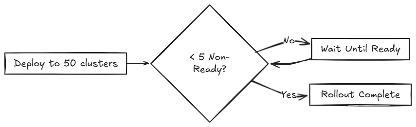

# Rollout Strategy in Fleet

Fleet uses a rollout strategy to control how apps are deployed across clusters. This feature allows you to define the order and grouping of cluster deployments, enabling controlled rollouts, and safer updates. 

Fleet evaluates the **Ready** status of each `BundleDeployment` to determine when to proceed to the next group. For more information, refer to [Status Fields](ref-status-fields.md).

During a rollout, the GitRepo status indicates deployment progress. This help you understand when bundles become Ready before continuing:

* For initial deployments:
  * One cluster may be marked as **NotReady**.
  * Remaining clusters are marked as **Pending**, meaning deployment hasn't started.
* For rollouts:
  * One cluster may be **NotReady** state.
  * Remaining clusters are marked **OutOfSync** until the current one is ready.

The rollout behavior is configured in the [`rolloutStrategy` in the `fleet.yaml`](ref-fleet-yaml.md)

## How Does Partitioning Work?

Partitions are considered non-ready if they have clusters that exceed the allowed number of non-ready clusters. This threshold is determined by:

* **Manual partitions**: Use `maxUnavailable` value inside each partition to control readiness for that partition.
* **Automatic partitions** or **unset values**: Use `rolloutStrategy.maxUnavailable` value is used to control when a partition is ready.

Fleet proceeds only if the number of non-ready partitions remains below `maxUnavailablePartitions`.

:::note
Fleet rolls out deployments in batches of up to 50 clusters, regardless of partition size. After each batch, Fleet checks the `maxUnavailable` threshold before continuing. For example:

* If a partition has 25 clusters and `maxUnavailable` is 5, Fleet deploys to all 25 before evaluating readiness.
* If a partition has 100 clusters, Fleet deploys to the first 50, checks `maxUnavailable`, and proceeds with the remaining 50 only if the threshold is not exceeded.
:::


Various limits that can be configured in Fleet:

| Field | Description | Default |
| -- | ---- | -- |
| maxUnavailable | Maximum number or percentage of clusters that can be non-ready before halting rollout. | 100% |
| maxUnavailablePartitions | Number or percentage of partitions that can be non-ready at once. | 0 |
| autoPartitionSize | Number or percentage of clusters per auto-created partition. | 25% |
| partitions | Define manual partitions by cluster labels or group. If set, autoPartitionSize is ignored. | – |

Fleet supports automatic and manual rollout partitioning. For a full reference of configuration options, refer to the [`rolloutStrategy` in  fleet.yaml.](ref-fleet-yaml.md)

**Automatic Partitioning:** Fleet automatically creates partitions using autoPartitionSize.

* If fewer than 200 clusters, Fleet uses a single partition.  
* If 200+ clusters, partitions are created based on autoPartitionSize.

For Example, you have 200 clusters and set `autoPartitionSize` to 25%, Fleet creates four partitions of 50 clusters each. Rollout proceeds in 50-cluster batches, checking maxUnavailable before continuing.

**Manual Partitioning:** You define specific partitions using the partitions field. This gives you fine-grained control over cluster groupings and rollout order.

:::note
If you specify partitions manually, the `autoPartitionSize` is ignored.
:::

Partitions can be specified by name, `cluster selector`, `cluster group`, and `clusterGroupSelector`.

For example, consider creating a partition named `demoRollout` for production clusters in a specific group:

```yaml
rolloutStrategy:
  partitions:
    - name: demoRollout
      maxUnavailable: 10%
      clusterSelector:
        matchLabels:
          env: prod
      clusterGroup: frontend
```

Fleet then:

1. Selects clusters based on `clusterSelector`, `clusterGroup`, or `clusterGroupSelector`.  
2. Starts rollout to the first partition.  
3. Waits until the partition is **Ready** (or within maxUnavailable threshold).  
4. Proceeds to the next partition.

### Single Partition Rollout

Fleet automatically creates a single partition only for clusters <200, and then it is 25% of all clusters, because that is the default value for autoPartitionSize.

If you don’t define partitions, Fleet creates them automatically based on the number of target clusters:

* For fewer than 200 clusters, Fleet uses a single partition.
* For 200 or more clusters, Fleet uses the default `autoPartitionSize` value(25%) of the total.

For example, consider 200 clusters, Fleet uses the default `autoPartitionSize` of 25%. This means, Fleet creates 4 partitions (25% of 200 = 50 clusters per partition). Fleet processes up to 50 clusters at a time, which means it:

1. Rolls out to the first 50 clusters.
1. Evaluate readiness based on `maxUnavailable`.
1. If the condition is met, proceed to the next 50, and so on.

Use the `maxUnavailable` setting to control how many clusters in a partition can be non-ready at once. If this threshold is exceeded, Fleet pauses the rollout until enough clusters become ready.

### Multiple Partitions Rollout
When you define multiple partitions, Fleet uses maxUnavailablePartitions to limit how many partitions can be non-ready at once. If the number of non-ready partitions exceeds maxUnavailablePartitions, Fleet pauses the rollout.

## Preventing image pull storms

During rollout, each downstream cluster pulls container images. If hundreds of clusters begin pulling images simultaneously, this can overwhelm the registry and behave like a DDoS attack.

To avoid this, Fleet controls how many clusters are updated at a time. You can use the following rollout configuration options to slow down and stage the rollout:

* `autoPartitionSize`
* `partitions`
* `partitions`	
* `maxUnavailable`

Fleet does not add artificial delays—progression depends on when workloads become Ready. This is typically influenced by factors like image pull time and readiness probes. While readiness probes are recommended, they are not strictly required to control rollout speed.


For example, you have 200 clusters, which are Manual partitions, each with 40 clusters and want to prevent image pull storm:

* `maxUnavailablePartitions`: Set to 0 or 1.
* `maxUnavailable`: Set to 10%.

How rollout proceeds:

1. Fleet begins with the first partition (40 clusters).
1. It creates up to 50 BundleDeployments at once. So it deploys to all 40 clusters in the partition in one batch.
1. Fleet checks the readiness of clusters in the partition.
  1. If more than 4 clusters are not ready, rollout is paused.
  1. Once ≤4 clusters are non-ready, Fleet proceeds.
1. When the entire partition is mostly ready, Fleet moves to the next partition, because maxUnavailablePartitions: 1.

:::note
Fleet recommends labeling clusters and triggering rollouts based on label selectors.
::: 

## Use Cases and Behavior

### Scenario: 50 Clusters( Single Partition) 

```yaml
rolloutStrategy: 
maxUnavailable: 10%
```

* Fleet creates one partition containing all 50 clusters, since no partitions are defined.  
  * No requirement to specify maxUnavailablePartitions, as you have only one.  
* Although there is no specified manual partition and maxUnavailable is set to 10%, Fleet deploys to all 50 clusters at once (batch behavior overrides maxUnavailable initially).  
* Evaluation occurs after all deployments are created.



To mitigate high image pull risk, add a readiness probe and set a lower `maxUnavailable` to delay progression.

### Scenario: 100 Clusters( Single Partition) 

```yaml
rolloutStrategy: 
maxUnavailable: 10%
```

* Fleet creates one partition containing all 100 clusters, since no partitions are defined.  
  * No requirement to specify maxUnavailablePartitions, as you have only one.  
* Although there is no specified manual partition and maxUnavailable is set to 10%, Fleet deploys to all 50 clusters at once (batch behavior overrides maxUnavailable initially).

If 10 clusters (10% of 100 clusters) are unavailable, the deployment of the remaining 50 clusters are paused until less than 10 clusters are non-ready. 


### Scenario: 200 Clusters (Multiple Partitions)

```yaml
rolloutStrategy:
  maxUnavailablePartitions: 1
  autoPartitionSize: 10%
```

* Fleet creates 10 partitions, each with 20 clusters.  
* Deployment proceeds sequentially by partition.  
* If two or more partitions become non-ready, rollout pauses.  
* If one partition is non-ready, rollout can proceed to the next.

Fleet creates `BundleDeployments` for 10 clusters, waits for them to become **Ready**, then proceeds to the next. Image pull activity is rate-limited, preventing overload.

### Scenario: 200 Clusters (Strict Readiness, Manual partitions)
Manual partition allows you **control over cluster grouping** with `maxUnavailablePartitions: 0`—manual partitioning is more appropriate. 

```yaml
rolloutStrategy:
  maxUnavailablePartitions: 0
  partitions:
    - name: demoRollout
      clusterSelector:
        matchLabels:
          stage: demoRollout
    - name: stable
      clusterSelector:
        matchLabels:
          stage: stable
```

* You define manual partitions using `clusterSelector` and labels like `stage: demoRollout` and `stage: stable`.  
* Fleet creates `BundleDeployments` for clusters in the first partition (for example, `demoRollout`).  
* The rollout proceeds strictly in order, Fleet only moves to the next partition when the current one is ready.  
* With `maxUnavailablePartitions: 0`, any non-ready cluster stops the rollout.


This ensures full readiness and staged rollout across all 200 clusters. Use this approach when you need precise rollout sequencing and full cluster readiness before advancing. 
