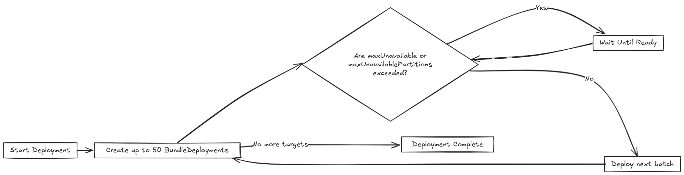

# Rollout Strategy in Fleet

Fleet uses a rollout strategy to control how apps are deployed across clusters. This feature allows you to define the order and grouping of cluster deployments, enabling controlled rollouts, and safer updates. Fleet evaluates the **Ready** status of each `BundleDeployment` to determine when to proceed to the next group. For more information, refer to [Status Fields](./ref-status-fields.md).

For initial deployments:

* One cluster may be shown as **NotReady**.

* Remaining clusters appear as **Pending**.

For rollouts:

* One cluster may be **NotReady**.

* Remaining clusters are marked **OutOfSync** until the current one becomes ready

Fleet creates up to 50 BundleDeployments at a time,  regardless of the rollout configuration. After creating a batch, Fleet evaluates the deployment status. If the current batch meets readiness criteria, Fleet proceeds to the next batch. Otherwise, it pauses the rollout.

The rollout behavior is configured in the [`rolloutStrategy` in the `fleet.yaml`](./ref-fleet-yaml.md)

## How Does Partitioning Work?

Partitions are considered non-ready if any cluster in the partition is not Ready. Deployment continues only if the number of non-ready partitions remains below maxUnavailablePartitions.

:::note
Fleet deploys up to 50 clusters at a time regardless of partition size.
:::



Various limits that can be configured in Fleet:

| Field | Description | Default |
| ----- | ----- | ----- |
| maxUnavailable | Maximum number or percentage of clusters that can be non-ready before halting rollout. | 100% |
| maxUnavailablePartitions | Number or percentage of partitions that can be non-ready at once. | 0 |
| autoPartitionSize | Number or percentage of clusters per auto-created partition. | 25% |
| partitions | Define manual partitions by cluster labels or group. If set, autoPartitionSize is ignored. | – |

Fleet supports both automatic and manual rollout partitioning. For more information, refer to the [rolloutStrategy in  fleet.yaml.](./ref-fleet-yaml.md)

**Automatic Partitioning:** Fleet automatically creates partitions using autoPartitionSize.

* If fewer than 200 clusters, Fleet uses a single partition.  
* If 200+ clusters, partitions are created based on autoPartitionSize.

**Manual Partitioning:** You define specific partitions using the partitions field. This gives you fine-grained control over cluster groupings and rollout order.

:::note
If you specify partitions manually, the autoPartitionSize is ignored.
:::

Partitions can be specified by name, `cluster selector`, `cluster group`, and `clusterGroupSelector`.

For example, consider creating a partition named canary for production clusters in a specific group:

```yaml
rolloutStrategy:
  partitions:
    - name: canary
      maxUnavailable: 10%
      clusterSelector:
        matchLabels:
          env: prod
      clusterGroup: frontend
```

Fleet then:

1. Selects clusters based on `clusterSelector`, `clusterGroup`, or `clusterGroupSelector`.  
2. Starts rollout to the first partition.  
3. Waits until the partition is **Ready** (or within maxUnavailable threshold).  
4. Proceeds to the next partition.

### Single Partition Rollout

If you do not define partitions, Fleet creates a single partition with all clusters. Use the `maxUnavailable` setting to limit how many clusters can be non-ready at once. If this limit is exceeded, Fleet pauses the rollout until enough clusters become ready.

Fleet automatically creates a single partition only for clusters \<200, and then it is 25% of all clusters, because that is the default value for autoPartitionSize.

### Multiple Partitions Rollout
When you define multiple partitions, Fleet uses maxUnavailablePartitions to limit how many partitions can be non-ready at once. If the number of non-ready partitions exceeds maxUnavailablePartitions, Fleet pauses the rollout.


## Preventing image pull storms

During rollout, each downstream cluster pulls container images. If Fleet triggers updates on hundreds of clusters at once, all may start pulling images simultaneously—causing registry overload or DDoS-like behavior.

To mitigate this Fleet uses a reconciliation loop to progressively rollout workloads. It is staged using:

* BundleDeployment readiness status  
* autoPartitionSize for automatic partitioning  
* Manual partitions to control rollout order  
* maxUnavailablePartitions to pause rollouts when partitions are not ready


:::note
Set `maxUnavailablePartitions` to `0` or `1` for slow rollout. Fleet does **not** introduce artificial delay—readiness probes must manage progression.
:::

Fleet recommends labeling clusters and triggering rollouts based on label selectors.

## Use Cases and Behavior

### Scenario: 50 Clusters( Single Partition) 

```yaml
rolloutStrategy: 
maxUnavailable: 10%
```

* Fleet creates one partition containing all 50 clusters, since no partitions are defined.  
  * No requirement to specify maxUnavailablePartitions, as you have only one.  
* Although there is no specified manual partition and maxUnavailable is set to 10%, Fleet deploys to all 50 clusters at once (batch behavior overrides maxUnavailable initially).  
* Evaluation occurs after all deployments are created.


To mitigate high image pull risk, add a readiness probe and set a lower `maxUnavailable` to delay progression.

### Scenario: 100 Clusters( Single Partition) 

```yaml
rolloutStrategy: 
maxUnavailable: 10%
```

* Fleet creates one partition containing all 100 clusters, since no partitions are defined.  
  * No requirement to specify maxUnavailablePartitions, as you have only one.  
* Although there is no specified manual partition and maxUnavailable is set to 10%, Fleet deploys to all 50 clusters at once (batch behavior overrides maxUnavailable initially).

If 10 clusters (10% of 100 clusters) are unavailable, the deployment of the remaining 50 clusters are paused until less than 10 clusters are non-ready. 


### Scenario: 200 Clusters (Multiple Partitions)

```yaml
rolloutStrategy:
  maxUnavailablePartitions: 1
  autoPartitionSize: 10%
```

* Fleet creates 00 partitions, each with 10 clusters.  
* Deployment proceeds sequentially by partition.  
* If two or more partitions become non-ready, rollout pauses.  
* If one partition is non-ready, rollout can proceed to the next.

Fleet creates `BundleDeployments` for 10 clusters, waits for them to become **Ready**, then proceeds to the next. Image pull activity is rate-limited, preventing overload.

### Scenario: 200 Clusters (Strict Readiness, Manual partitions)
Manual partition allows you **control over cluster grouping** with `maxUnavailablePartitions: 0`—manual partitioning is more appropriate. 

```yaml
rolloutStrategy:
  maxUnavailablePartitions: 0
  partitions:
    - name: canary
      clusterSelector:
        matchLabels:
          stage: canary
    - name: stable
      clusterSelector:
        matchLabels:
          stage: stable
```

* You define manual partitions using `clusterSelector` and labels like `stage: canary` and `stage: stable`.  
* Fleet creates `BundleDeployments` for clusters in the first partition (for example, `canary`).  
* The rollout proceeds strictly in order, Fleet only moves to the next partition when the current one is ready.  
* With `maxUnavailablePartitions: 0`, any non-ready cluster stops the rollout.


This ensures full readiness and staged rollout across all 200 clusters. Use this approach when you need precise rollout sequencing and full cluster readiness before advancing. 
