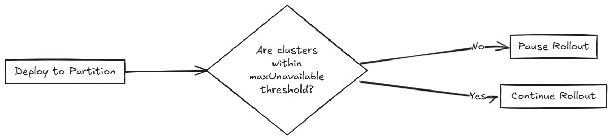

# Rollout Strategy

Fleet uses a rollout strategy to control how apps are deployed across clusters. You can define the order and grouping of cluster deployments using partitions, enabling controlled rollouts and safer updates.

Fleet evaluates the `Ready` status of each `BundleDeployment` to determine when to proceed to the next partition. For more information, refer to [Status Fields](ref-status-fields.md).

During a rollout, the GitRepo status indicates deployment progress. This helps you understand when bundles become `Ready` before continuing:

* For initial deployments:
  * One or more clusters may be in a `NotReady` state.
  * Remaining clusters are marked as `Pending`, meaning deployment has not started.
* For rollouts:
  * One or more cluster may be in a `NotReady` state.
  * Remaining clusters are marked `OutOfSync` until the deployment continues.

The rollout configuration options are documented in the [`rolloutStrategy` field of the `fleet.yaml` reference](ref-fleet-yaml.md).

:::note
If `rolloutStrategy` is not specified in `fleet.yaml`, Fleet uses the default values.
:::

## How Does Partitioning Work?

Partitions are considered `NotReady` if they have clusters that exceed the allowed number of `NotReady` clusters. This threshold is determined by:

* **Manual partitions**: Use `maxUnavailable` value inside each partition to control readiness for that partition, otherwise, if unspecified, it uses `rolloutStrategy.maxUnavailable`.
* **Automatic partitions**: Use `rolloutStrategy.maxUnavailable` value to control when a partition is ready.

Fleet proceeds only if the number of `NotReady` partitions remains below `maxUnavailablePartitions`.

:::note
Fleet rolls out deployments in batches of up to 50 clusters per partition, regardless of partitions having more clusters assigned. After each batch, Fleet checks the `maxUnavailable` threshold before continuing. After all deployments for a partition have been created, `maxUnavailable` is also evaluated. For example:

* If a partition has 25 clusters and `maxUnavailable` is 5, Fleet deploys to all 25 before checking `maxUnavailable`.
* If a partition has 100 clusters, Fleet deploys to the first 50, checks `maxUnavailable`, and proceeds with the remaining 50 only if the threshold is not exceeded.
:::


Various limits that can be configured in Fleet:

| Field | Description | Default |
| -- | ---- | -- |
| maxUnavailable | Maximum number or percentage of clusters that can be `NotReady` before halting rollout. | 100% |
| maxUnavailablePartitions | Number or percentage of partitions that can be `NotReady` at once. | 0 |
| autoPartitionSize | Number or percentage of clusters per auto-created partition. | 25% |
| partitions | Define manual partitions by cluster labels or group. If set, autoPartitionSize is ignored. | – |

Fleet supports automatic and manual partitioning. For more information about configuration options, refer to the [`rolloutStrategy` option in the fleet.yaml reference.](ref-fleet-yaml.md)

**Automatic Partitioning**: Fleet automatically creates partitions using `autoPartitionSize`.

* If fewer than 200 clusters are targeted, Fleet uses a single partition.  
* If 200+ clusters are targeted, partitions are created based on `autoPartitionSize`.

For example, you have 200 clusters and set `autoPartitionSize` to 25%, Fleet creates four partitions of 50 clusters each. Rollout proceeds in 50-cluster batches, checking `maxUnavailable` before continuing.

**Manual Partitioning**: You define specific partitions using the `partitions` option. This provides control over cluster selection and rollout order.

:::note
If you specify partitions manually, the `autoPartitionSize` is ignored.
:::

For example, consider:

```yaml
rolloutStrategy:
  partitions:
    - name: demoRollout
      maxUnavailable: 10%
      clusterSelector:
        matchLabels:
          env: staging
    - name: stable
      maxUnavailable: 5%
      clusterSelector:
        matchLabels:
          env: prod
```

Fleet then:

1. Selects clusters based on `clusterSelector`, `clusterGroup`, or `clusterGroupSelector`.  
  * Partitions can be specified by `clusterName`, `clusterSelector`, `clusterGroup`, and `clusterGroupSelector`.
2. Starts rollout to the first partition.  
3. Waits until the partition is considered `Ready` (depending on the `maxUnavailable` threshold).  
4. Proceeds to the next partition.

:::note
Fleet recommends labeling clusters so you can use those labels to assign clusters to specific partitions.
::: 

:::note
Fleet processes partitions in the order they appear in the `fleet.yaml` file.
:::

### Single Partition

If you don’t define `rolloutStrategy.partitions`, Fleet creates partitions automatically based on the number of targeted clusters:

* For fewer than 200 clusters, Fleet uses a single partition.
* For 200 or more clusters, Fleet uses the default `autoPartitionSize` value (25%) of the total.

For example, consider 200 clusters, Fleet uses the default `autoPartitionSize` of 25%. This means, Fleet creates 4 partitions (25% of 200 = 50 clusters per partition). Fleet processes up to 50 clusters at a time, which means it:

1. Rolls out to the first 50 clusters.
1. Evaluate readiness based on `maxUnavailable`.
1. If the condition is met, proceed to the next 50, and so on.

### Multiple Partition

If you define multiple partitions, Fleet uses `maxUnavailablePartitions` to limit how many partitions can be `NotReady` at once. If the number of `NotReady` partitions exceeds `maxUnavailablePartitions`, Fleet pauses the rollout.

## Preventing image pull storms

During rollout, each downstream cluster pulls container images. If hundreds of clusters begin pulling images simultaneously, this can overwhelm the registry and behave like a DDoS attack.

To avoid this, Fleet can control how many clusters are updated at a time. You can use the following rollout configuration options to slow down and stage the rollout:

* `autoPartitionSize`
* `partitions`
* `maxUnavailable`

Fleet does not add artificial delays during rollout. Instead, it proceeds based on the `readiness` status of workloads in each cluster. Factors that affect readiness include image pull time, startup time, and readiness probes. Although using readiness probes is recommended, they are not strictly required to control rollout speed.


For example, you have 200 clusters, which are manually partitioned, each with 40 clusters and want to prevent image pull storm:

* `maxUnavailablePartitions`: Set to 0.
* `maxUnavailable`: Set to 10%.

How rollout proceeds:

1. Fleet begins with the first partition (40 clusters).
1. It deploys up to 50 BundleDeployments at once. So it deploys to all 40 clusters in the partition in one batch.
1. Fleet checks the readiness of clusters in the partition.
  1. If more than 4 clusters are not ready, then the partition is considered `NotReady` and the rollout is paused.
  1. Once ≤4 clusters are `NotReady`, Fleet proceeds with the deployment.
1. When the entire partition is mostly ready (90%), Fleet moves to the next partition.

If you want or need to process less than 40 deployments at once, you can put less clusters into each partition.

## Use Cases and Behavior

If the number of clusters doesn’t divide evenly, Fleet rounds down partition sizes. For example, 230 clusters with `autoPartitionSize: 25%` results in:

* Four partitions of 57 clusters
* One partition of 2 clusters

### Scenario: 50 Clusters (Single Partition)

```yaml
rolloutStrategy: 
  maxUnavailable: 10%
```

* Fleet creates one partition containing all 50 clusters, since no partitions are defined.
  * No requirement to specify `maxUnavailablePartitions`, as only one partition is created.
* Although there is no specified manual partition and `maxUnavailable` is set to 10%, Fleet deploys to all 50 clusters at once (batch behavior overrides `maxUnavailable` initially).  
* Evaluation occurs after all deployments are created.


### Scenario: 100 Clusters (Single Partition) 

```yaml
rolloutStrategy: 
  maxUnavailable: 10%
```

* Fleet creates one partition containing all 100 clusters, since no partitions are defined.  
  * No requirement to specify `maxUnavailablePartitions`, as you have only one.  
* Although there is no specified manual partition and `maxUnavailable` is set to 10%, Fleet deploys to 50 clusters at once (batch behavior overrides `maxUnavailable` initially).

If 10 clusters (10% of 100 clusters) are unavailable, the deployment of the remaining 50 clusters is paused until less than 10 clusters are `NotReady`. 

### Scenario: 200 Clusters (Multiple Partitions)

```yaml
rolloutStrategy:
  maxUnavailablePartitions: 1
  autoPartitionSize: 10%
```

* Fleet creates 10 partitions, each with 20 clusters.
* Deployment proceeds sequentially by partition.
* If two or more partitions become `NotReady`, rollout pauses.
* If one partition is `NotReady`, rollout can proceed to the next.

Fleet creates `BundleDeployments` for 20 clusters, waits for them to become `Ready`, then proceeds to the next. This effectively limits the amount of image pulls from downstream clusters to up to ~40 images at a time.

### Scenario: 200 Clusters (Strict Readiness, Manual partitions)

Manual partitioning allows you control over cluster grouping with `maxUnavailablePartitions: 0`. 

```yaml
rolloutStrategy:
  maxUnavailable: 0
  maxUnavailablePartitions: 0
  partitions:
    - name: demoRollout
      clusterSelector:
        matchLabels:
          stage: demoRollout
    - name: stable
      clusterSelector:
        matchLabels:
          stage: stable
```

* You define manual partitions using `clusterSelector` and labels like `stage: demoRollout` and `stage: stable`.
* Fleet creates `BundleDeployments` for clusters in the first partition (for example, `demoRollout`).
* The rollout proceeds strictly in order, Fleet only moves to the next partition when the current one is considered ready.
* With `maxUnavailable: 0` and `maxUnavailablePartitions: 0`, Fleet pauses the rollout if any partition is not considered ready.



This ensures full readiness and staged rollout across all 200 clusters. Use this approach when you need precise rollout sequencing and full cluster readiness before advancing. 

## Rollout Strategy Defaults

If partition-level rollout values are not defined, Fleet applies the global values from `rolloutStrategy` in `fleet.yaml`. Partition-specific settings override global values when explicitly set.

By default, Fleet sets:

* `maxUnavailable` to `100%`: All clusters in a partition can be `NotReady` and still be considered Ready. 
* `maxUnavailablePartitions` to `0`: Prevents rollout only when one or more partitions are considered `NotReady`. However, this check is ineffective if all partitions appear Ready due to `maxUnavailable: 100%`. |

For example, consider 200 clusters with default settings:

* Fleet creates 4 partitions of 50 clusters each (`autoPartitionSize: 25%`).
* Because `maxUnavailable` is `100%`, each partition is treated as `Ready` immediately.
* Fleet proceeds through all partitions regardless of actual readiness.

Fleet recommends you to control rollouts by setting:

* Lower `maxUnavailable`, e.g. 10%.
* Set `maxUnavailablePartitions` to 0 or higher, if desired.

This ensures:

* Partitions meet readiness before rollout continues.
* Fleet pauses rollout if too many partitions are not ready.
