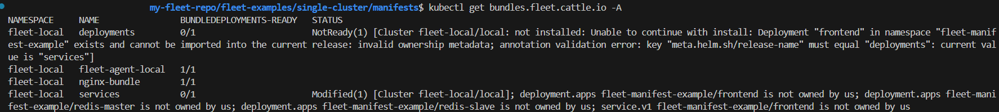

# Validate Fleet CLI Deployment

After applying a bundle using Fleet CLI, you can validate the deployment by inspecting the `Bundle` and its associated `BundleDeployments`.

Each Fleet-managed cluster lists:

* Which bundles are deployed to it.  
* Their readiness status.  
* Errors or sync issues (if any).

To validate whether your `fleet apply` created a `bundle` and if it’s deployed to the right number of target(s), run: 

```bash
kubectl get bundles.fleet.cattle.io -A
```



You see the following fields:

* `BUNDLEDEPLOYMENTS-READY` shows how many targets are ready out of the total.  
* `STATUS` may show Ready, Modified, or other conditions based on the `rollout`.

:::note
If this field shows 1/1, the bundle is successfully deployed to one cluster.
:::

To get a detailed view of how the bundle was rendered and applied:

`kubectl get bundles.fleet.cattle.io -n fleet-local my-nginx-bundle -o yaml`

Look for the following fields in the `status` section:

```yaml
status:  
  display:  
    readyClusters: 1/1  
  summary:  
    desiredReady: 1  
    ready: 1  
  conditions:  
    type: Ready  
    status: "True"
```

This indicates that:

* The bundle was scheduled for 1 cluster.  
* The target cluster has acknowledged and applied the resources.  
* The controller marked the deployment as ready.

You can also verify the corresponding `BundleDeployment` object, since each `BundleDeployment` corresponds to a target cluster.

`kubectl get bundledeployments.fleet.cattle.io -A`

For more information, refer to [Status Fields](ref-status-fields.md).
