# Cluster Registration Internals

## How does cluster registration work?

This text describes cluster registration with more technical details. The text ignores agent initiated registration, as it’s not commonly used.
[Agent initiated registration](./cluster-registration.md#agent-initiated) is ["`ClusterRegistrationToken` first"](./cluster-registration.md#create-cluster-registration-tokens), which means pre-creating a cluster is optional.

See "[Register Downstream Clusters](./cluster-registration.md)" to learn how to register clusters.

### Cluster first

`fleet-controller` starts up and may "bootstrap" the local cluster resource. In Rancher creating the local cluster resource is handled by the fleetcluster controller instead, but otherwise the process is identical.

The process is identical for the local cluster or any downstream cluster. It starts by  creating a cluster resource, which refers to a kubeconfig secret.

### Creating the Bootstrap Secret for the Downstream Cluster

In this step a `ClusterRegistationToken` and an "import" service account are created based on a `Cluster` resource.

The Fleet controller creates a [`ClusterRegistrationToken`](./architecture.md#security)
and waits for it to be complete. The `ClusterRegistationToken` triggers the creation of the "import" service account, which can create
`ClusterRegistrations` and read any secret in the system registration namespace (eg "cattle-fleet-clusters-system"). The `import.go` controller will
enqueue itself until the "import" service account exists, because that account is needed to create the `fleet-agent-bootstrap` secret.

### Creating the Fleet Agent Deployment

The Fleet controller will now create the Fleet agent deployment and the bootstrap secret on the downstream cluster.

The bootstrap secret contains the API server URL of the upstream cluster and is used to build a kubeconfig to access the upstream cluster. Both values are taken from the Fleet controller config configmap. That configmap is part of the helm chart.

### Fleet Agent Starts Registration, Upgrades to Request Account

The agent uses the "import" account to upgrade to a request account.

Immediately the Fleet agent checks for a `fleet-agent-bootstrap` secret. If the bootstrap secret, which contains the "import" kubeconfig, is present the agent starts registering.

Then agent creates the final `ClusterRegistration` resource in fleet-default on the management cluster, with a random number. The random number will be used for the registration secret's name.

The Fleet controller triggers and tries to grant the `ClusterRegistration` request to create agent's service account and create the 'c-\*' registration secret with the client's new kubeconfig. The registration secret name is `hash("clientID-clientRandom")`.

The new kubeconfig uses the "request" account. The "request" account can access the cluster status, `BundleDeployments` and `Contents`.

### Fleet Agent is Registered, Watches for `BundleDeployments`

At this point the agent is fully registered and will persist the "request" account into a `fleet-agent` secret.
The API server URL and CA are copied from the bootstrap secret, which inherited these values from the Fleet controller's helm chart values.

The bootstrap secret is deleted. When the agent restarts, it will not re-register, since the bootstrap secret is missing.

The agent starts watching its "[Cluster Namespace](./namespaces.md#cluster-namespaces)" for `BundleDeployments`. At this point the agent is ready to deploy workloads.

### Notes

* The registration starts with the "import" account and pivots to the "request" account.
* The fleet-default namespace has all the cluster registrations, the "import" account uses a separate namespace.
* Once the agent is registered, `fleet-controller` will trigger on a cluster or namespace change. The `manageagent` controller will then create a bundle to adopt the existing agent deployment. The agent will update itself to the bundle and since the "generation" environment variable changes, it will restart.
* If no bootstrap secret exists, the agent will not re-register.

## Diagram

### Registration Flow

```mermaid
graph TD
    subgraph "Upstream (Management Cluster)"
        direction LR
        subgraph "Flow 1: Agent-Initiated"
            direction TB
            A0(Optional: Admin Creates Cluster with clientID) --> A1

            A1(Admin Creates<br>ClusterRegistrationToken) --> A2{Fleet Controller Creates Secret<br>for a temporary 'import' ServiceAccount}
        end
        subgraph "Flow 2: Manager-Initiated (for existing cluster)"
            direction TB
            B1(Admin Creates Kubeconfig Secret<br>for an existing cluster) --> B2(Admin Creates Cluster Resource<br>referencing the Kubeconfig Secret.<br>Can define a clientID here)
            B2 --> B3{Fleet Controller uses admin-provided<br>kubeconfig to deploy agent}
        end
    end

    subgraph "Downstream (Managed Cluster)"
        direction LR
        subgraph "Agent Install (Flow 1)"
            direction TB
            A3(Admin installs Fleet Agent via Helm<br>using the 'import' token secret.<br>Can provide clientID)
        end
        subgraph "Agent Deployed (Flow 2)"
             direction TB
             B4(Agent & bootstrap secret are deployed.<br>Bootstrap contains an 'import' kubeconfig.)
        end
    end

    subgraph "Common Registration Stages (Identity Handshake)"
        direction TB
        C1(Agent pod starts, using its local 'agent' SA.<br>Finds & uses the 'import' kubeconfig<br>from the bootstrap secret to talk to Upstream.)
        C1 --> C2(Using its 'import' identity, Agent creates<br>a ClusterRegistration resource on Upstream)
        C2 --> C3{Upstream Controller creates a permanent<br>'request' ServiceAccount & a new,<br>long-term kubeconfig/secret for it.}
        C3 --> C4(Agent receives and persists the<br>'request' SA credentials.<br>The temporary bootstrap secret is deleted.)
        C4 --> C5{Upstream Controller creates a dedicated<br>Cluster Namespace for this agent.}
        C5 --> C6(✅ Agent Fully Registered.<br>Uses its 'request' identity to watch<br>for workloads in its namespace.)
    end

    %% Styling
    style A0 fill:#e0f2fe,stroke:#0ea5e9,stroke-width:2px
    style A1 fill:#e0f2fe,stroke:#0ea5e9,stroke-width:2px
    style B1 fill:#e0f2fe,stroke:#0ea5e9,stroke-width:2px
    style A3 fill:#d1fae5,stroke:#10b981,stroke-width:2px
    style B2 fill:#e0f2fe,stroke:#0ea5e9,stroke-width:2px

    style A2 fill:#fef3c7,stroke:#f59e0b,stroke-width:2px
    style B3 fill:#fef3c7,stroke:#f59e0b,stroke-width:2px
    style B4 fill:#fef3c7,stroke:#f59e0b,stroke-width:2px

    style C1 fill:#f3e8ff,stroke:#8b5cf6,stroke-width:2px
    style C2 fill:#f3e8ff,stroke:#8b5cf6,stroke-width:2px
    style C3 fill:#f3e8ff,stroke:#8b5cf6,stroke-width:2px
    style C4 fill:#f3e8ff,stroke:#8b5cf6,stroke-width:2px
    style C5 fill:#f3e8ff,stroke:#8b5cf6,stroke-width:2px
    style C6 fill:#dcfce7,stroke:#22c55e,stroke-width:2px,font-weight:bold

    %% Connections
    A2 --> A3
    B3 --> B4
    A3 --> C1
    B4 --> C1
```

### Registration Process and Controllers

Detailed analysis of the registration process for clusters. This shows the interaction of controllers, resources and service accounts during the registration of a new downstream cluster or the local cluster.

It is important to note that there are multiple ways to start this:

* Creating a bootstrap config. Fleet does this for the local agent.
* Creating a `Cluster` resource with a kubeconfig. Rancher does this for downstream clusters. See [manager-initiated registration](./cluster-registration.md#manager-initiated).
* Create a `ClusterRegistrationToken` resource, optionally create a `Cluster` resource for a pre-defined (`clientID`) cluster. See [agent-initiated registration](./cluster-registration.md#agent-initiated).

### Secrets during Agent Deployment

This diagram shows the resources created during registration and focuses on the k8s API server configuration.

The `import.go` controller triggers on Cluster creation/update events and deploys the agent.

**This image shows how the API server URL and CA propagates through the secrets during registration:**

The arrows in the diagram show how the API server values are copied from
the Helm values to the cluster registration secret on the upstream
cluster and finally downstream to the bootstrap secret of the agent.

There is one special case, if the agent is for the local/"bootstrap"
cluster, the server values also exist in the kubeconfig secret,
referenced by the Cluster resource. In this case the kubeconfig secret
contains the upstream server URL and CA, next to the downstream's
kubeconfig. If the settings are present in the kubeconfig secret, they
override the configured values.

## Fleet Cluster Registration in Rancher

Rancher installs the fleet helm chart. The API server URL and CA are [derived from Rancher's settings](https://github.com/rancher/rancher/blob/main/pkg/controllers/dashboard/fleetcharts/controller.go#L113-L114).

Fleet will pass these values to a Fleet agent, so it can connect back to the Fleet controller.

### Import Cluster into Rancher

When the user runs `curl | kubectl apply`, the applied manifest includes the rancher agent deployment.

The deployment contains a secret `cattle-credentials-` which contains the API URL and a token.

The Rancher agent starts up and reports downstream's kubeconfig to upstream.

Rancher then creates the fleet Cluster resource, which references a [kubeconfig secret](https://github.com/rancher/rancher/blob/871b6d9137246bd93733f01184ea435f40c5d56c/pkg/provisioningv2/kubeconfig/manager.go#L69).

👉Fleet will use this kubeconfig to deploy the agent on the downstream cluster.
